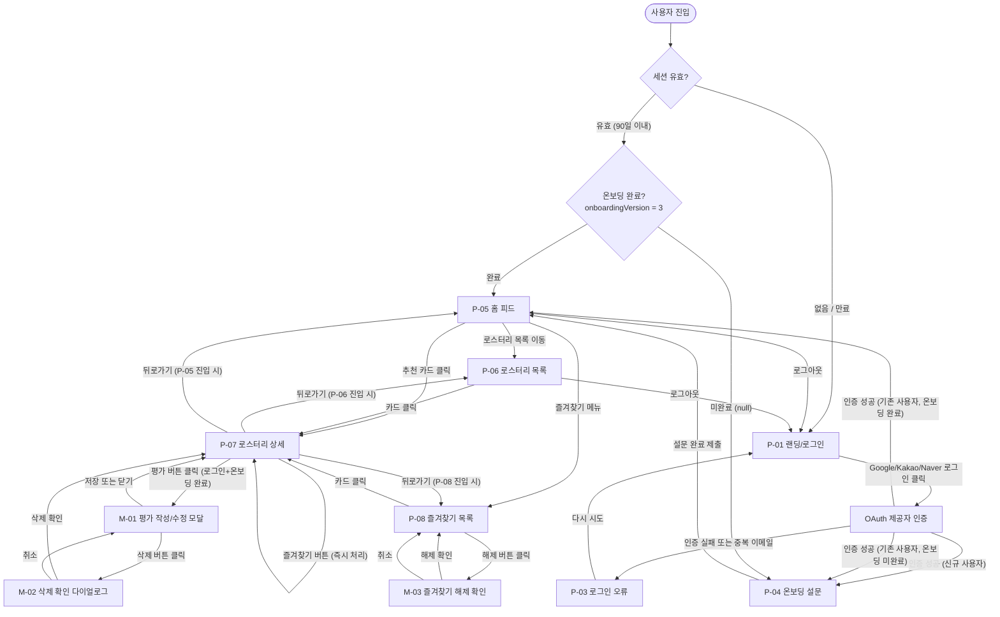
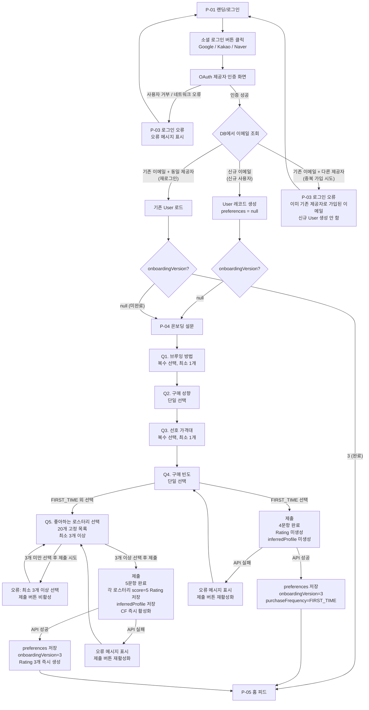
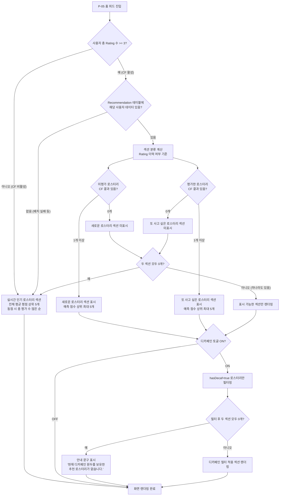
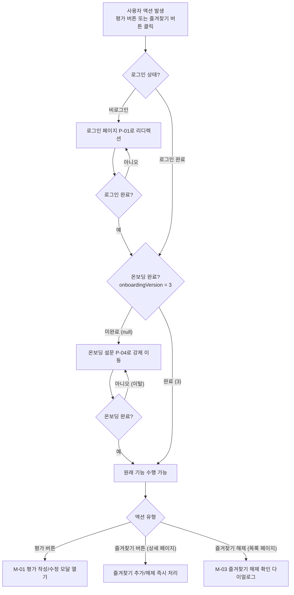

# Rocommend 화면 흐름 문서 (Screen Flow Document)

**문서 버전**: 1.0
**작성일**: 2026-03-01
**기반 PRD**: v1.29
**기반 유저 시나리오**: v1.0
**용도**: 개발자 라우팅 구조 및 컴포넌트 설계 참조

---

## 목차

1. [화면 인벤토리](#1-화면-인벤토리)
2. [화면 전환 흐름도](#2-화면-전환-흐름도)
   - 2-A. 전체 화면 전환 흐름
   - 2-B. 인증 및 온보딩 흐름
   - 2-C. 홈 피드 상태 분기 흐름
   - 2-D. 보호된 기능 접근 흐름
3. [화면별 명세](#3-화면별-명세)
4. [모달 및 다이얼로그 목록](#4-모달-및-다이얼로그-목록)
5. [라우팅 구조 요약](#5-라우팅-구조-요약)
6. [접근 권한 정책 요약](#6-접근-권한-정책-요약)

---

## 1. 화면 인벤토리

### 1.1 페이지 (Page)

| ID | 화면 이름 | URL 패턴 | 접근 권한 | 관련 기능 |
|----|----------|----------|----------|---------|
| P-01 | 랜딩/로그인 | `/` | 비로그인 전용 (로그인 시 홈 피드로 리디렉션) | F-001 |
| P-02 | OAuth 콜백 처리 | `/api/auth/callback/[provider]` | 시스템 내부 (NextAuth.js 처리) | F-001 |
| P-03 | 로그인 오류 | `/auth/error` | 비로그인 | F-001 |
| P-04 | 온보딩 설문 | `/onboarding` | 로그인 + 온보딩 미완료 전용 | F-002 |
| P-05 | 홈 피드 | `/home` | 로그인 + 온보딩 완료 필수 | F-006 |
| P-06 | 로스터리 목록 | `/roastery` | 비로그인 가능 (공개) | F-003, F-004 |
| P-07 | 로스터리 상세 | `/roastery/[id]` | 비로그인 가능 (공개) | F-003, F-005, F-007 |
| P-08 | 즐겨찾기 목록 | `/favorites` | 로그인 + 온보딩 완료 필수 | F-007 |
| P-09 | 404 에러 | `/not-found` (또는 Next.js `not-found.tsx`) | 공개 | — |

### 1.2 모달 및 다이얼로그 (Modal / Dialog)

| ID | 모달 이름 | 노출 위치 | 접근 권한 | 관련 기능 |
|----|----------|---------|----------|---------|
| M-01 | 평가 작성/수정 모달 | P-07 (로스터리 상세) | 로그인 + 온보딩 완료 | F-005 |
| M-02 | 평가 삭제 확인 다이얼로그 | M-01 내부 | 로그인 + 온보딩 완료 | F-005 |
| M-03 | 즐겨찾기 해제 확인 다이얼로그 | P-08 (즐겨찾기 목록) | 로그인 + 온보딩 완료 | F-007 |

> **참고**: 즐겨찾기 추가/제거는 확인 다이얼로그 없이 즉시 처리된다. M-03은 즐겨찾기 목록 페이지(P-08)에서 해제 버튼 클릭 시에만 표시된다 (상세 페이지에서의 즐겨찾기 해제는 즉시 처리).

---

## 2. 화면 전환 흐름도

### 2-A. 전체 화면 전환 흐름



---

### 2-B. 인증 및 온보딩 흐름 (상세)



---

### 2-C. 홈 피드 상태 분기 흐름



---

### 2-D. 보호된 기능 접근 흐름



---

## 3. 화면별 명세

---

### P-01. 랜딩/로그인

| 항목 | 내용 |
|------|------|
| **목적** | 비로그인 사용자가 서비스를 처음 접하는 진입점. 소셜 로그인으로 가입 또는 로그인을 유도한다. |
| **URL** | `/` |
| **접근 조건** | 비로그인 상태에서만 표시. 세션이 유효한 사용자가 접근하면 홈 피드(P-05)로 리디렉션. |
| **관련 기능** | F-001 |

**주요 UI 컴포넌트**

| 컴포넌트 | 설명 |
|---------|------|
| 서비스 로고 및 슬로건 | "원두 살 때, 나와 취향이 같은 사람들이 검증한 로스터리를 추천해드립니다." |
| Google 로그인 버튼 | "Google로 시작하기" — 클릭 시 Google OAuth 흐름 시작 |
| Kakao 로그인 버튼 | "Kakao로 시작하기" — 클릭 시 Kakao OAuth 흐름 시작 |
| Naver 로그인 버튼 | "Naver로 시작하기" — 클릭 시 Naver OAuth 흐름 시작 |
| 서비스 소개 문구 (선택) | 핵심 가치 제안을 시각화한 간략한 설명 영역 |

**가능한 액션 및 이동 대상**

| 액션 | 결과 |
|------|------|
| Google/Kakao/Naver 버튼 클릭 | OAuth 인증 → 신규면 P-04, 기존(온보딩 완료)면 P-05, 오류면 P-03 |

**상태 노트**
- 소셜 로그인 버튼은 3개 모두 항상 표시된다.
- 건너뛰기, 게스트 모드, 이메일 로그인 버튼은 제공하지 않는다.

---

### P-02. OAuth 콜백 처리 (내부)

| 항목 | 내용 |
|------|------|
| **목적** | OAuth 제공자 인증 완료 후 NextAuth.js가 처리하는 콜백 엔드포인트. 사용자에게 노출되는 UI 없음. |
| **URL** | `/api/auth/callback/[provider]` (`google`, `kakao`, `naver`) |
| **접근 조건** | 시스템 내부 처리. 직접 접근 시 홈 피드 또는 로그인으로 리디렉션. |
| **관련 기능** | F-001 |

**처리 로직**

1. 이메일 중복 검사: 동일 이메일 + 다른 제공자 → 오류 반환, P-03 이동.
2. 신규 사용자: User 레코드 생성 (`preferences = null`) → P-04 이동.
3. 기존 사용자 (온보딩 완료): → P-05 이동.
4. 기존 사용자 (온보딩 미완료): → P-04 이동.

---

### P-03. 로그인 오류

| 항목 | 내용 |
|------|------|
| **목적** | OAuth 인증 실패 또는 중복 이메일 시도 시 오류 메시지를 표시하고 재시도를 유도한다. |
| **URL** | `/auth/error` (쿼리 파라미터: `?error=[error_type]`) |
| **접근 조건** | 공개 (로그인 불필요) |
| **관련 기능** | F-001 |

**주요 UI 컴포넌트**

| 컴포넌트 | 설명 |
|---------|------|
| 오류 메시지 | 오류 유형별 메시지 표시 |
| 로그인 페이지로 돌아가기 버튼 | P-01로 이동 |

**오류 메시지 정책**

| 오류 유형 | 표시 메시지 |
|---------|-----------|
| 중복 이메일 (다른 제공자) | "이미 [기존 제공자]로 가입된 이메일입니다. [기존 제공자]로 로그인해주세요." |
| OAuth 인증 실패 (계정 거부) | "로그인이 취소되었습니다. 다시 시도해주세요." |
| 네트워크 오류 | "로그인 중 오류가 발생했습니다. 잠시 후 다시 시도해주세요." |

---

### P-04. 온보딩 설문

| 항목 | 내용 |
|------|------|
| **목적** | 신규 사용자의 취향 데이터를 수집하여 CF 추천 또는 폴백 추천의 기반을 마련한다. 설문 완료 전까지 홈 피드 접근을 차단한다. |
| **URL** | `/onboarding` |
| **접근 조건** | 로그인 완료 + `onboardingVersion = null` (온보딩 미완료) 상태에서만 접근 가능. 이미 완료한 사용자(`onboardingVersion = 3`)가 접근하면 P-05로 리디렉션. |
| **관련 기능** | F-002 |

**주요 UI 컴포넌트**

| 컴포넌트 | 설명 |
|---------|------|
| 진행 표시바 (Progress Bar) | 현재 문항 / 전체 문항 수 표시 (예: Q2/5). Q4=FIRST_TIME 선택 시 전체 4문항으로 동적 업데이트. |
| Q1. 브루잉 방법 | 복수 선택(최소 1개). 선택지: 핸드드립 / 에스프레소 기반 / 콜드브루 / 프렌치프레스·에어로프레스 / 다양하게·모름 |
| Q2. 구매 성향 | 단일 선택. 선택지: 탐험 선호 / 단골 반복 / 균형 / 가성비 우선 |
| Q3. 선호 가격대 | 복수 선택(최소 1개). 선택지: 20,000원 미만 / 20,000~35,000원 / 35,000원 이상 / 크게 신경 안 써요 |
| Q4. 구매 빈도 | 단일 선택. 선택지: 처음 구매해요 / 분기 1회 이하 / 월 1회 / 월 2~3회 / 월 4회 이상 |
| Q5. 좋아하는 로스터리 선택 | 복수 선택(최소 3개 이상, 상한 없음). 큐레이션된 20개 고정 목록. **Q4=FIRST_TIME 선택 시 이 화면 미표시.** |
| 다음 버튼 | 현재 문항 조건 충족 시 활성화. 미충족 시 비활성화 또는 오류 메시지 표시. |
| 제출 버튼 (최종 문항) | Q5: 3개 이상 선택 시 활성화. Q4=FIRST_TIME 종료 시: 항상 활성화. |
| 건너뛰기 버튼 | **미제공.** 모든 문항 응답 전 제출 불가. |

**가능한 액션 및 이동 대상**

| 액션 | 결과 |
|------|------|
| Q4에서 FIRST_TIME 선택 후 제출 | 4문항 완료. Rating 미생성. `onboardingVersion=3` 저장. → P-05 |
| Q5에서 3개 이상 선택 후 제출 | 5문항 완료. 선택 로스터리 score=5 Rating 저장. CF 즉시 활성화. → P-05 |
| Q5에서 3개 미만 선택 후 제출 시도 | 오류 메시지 "최소 3개 이상 선택해주세요." 제출 차단. |
| API 제출 실패 | 오류 메시지 "저장 중 오류가 발생했습니다. 다시 시도해주세요." 제출 버튼 재활성화. |
| 이탈 (브라우저 닫기 / URL 직접 변경) | `preferences` 저장 안 됨. 재방문 시 Q1부터 다시 시작. |

**상태 노트**
- 문항 간 이동은 클라이언트 사이드 상태 관리로 처리한다 (단일 페이지 내 스텝 전환).
- 이전 버튼 제공 여부는 UX 결정 사항이나, 서버 저장은 최종 제출 시점에만 발생한다.
- 로스터리 목록(P-06) 및 상세(P-07)는 온보딩 미완료 상태에서도 접근 가능하다. 단, 해당 페이지에서 평가·즐겨찾기 버튼 클릭 시 P-04로 강제 이동.

---

### P-05. 홈 피드

| 항목 | 내용 |
|------|------|
| **목적** | 로그인 사용자의 메인 허브. CF 추천 결과 또는 폴백 추천을 두 섹션으로 표시하여 로스터리 탐색과 구매 결정을 지원한다. |
| **URL** | `/home` |
| **접근 조건** | 로그인 + 온보딩 완료(`onboardingVersion = 3`) 필수. 비로그인 접근 시 P-01로, 온보딩 미완료 접근 시 P-04로 리디렉션. |
| **관련 기능** | F-006 |

**주요 UI 컴포넌트**

| 컴포넌트 | 표시 조건 | 설명 |
|---------|---------|------|
| 글로벌 네비게이션 바 | 항상 | 홈 피드 / 로스터리 목록 / 즐겨찾기 / 로그아웃 링크 |
| 디카페인 토글 | CF 활성 시 | "디카페인만 보기" 토글. 세션 내 유지, 새로고침 시 초기화. |
| "새로운 로스터리" 섹션 | CF 활성 + 미평가 추천 1개 이상 | CF 예측 점수 상위 최대 5개. 평가 이력 없는 로스터리. |
| "또 사고 싶은 로스터리" 섹션 | CF 활성 + 평가한 추천 1개 이상 | CF 예측 점수 상위 최대 5개. 평가 이력 있는 로스터리. |
| "실시간 인기 로스터리" 섹션 | CF 비활성 또는 두 CF 섹션 모두 0개 | 전체 평균 평점 상위 5개. 동점 시 총 평가 수 많은 순. |
| 디카페인 안내 문구 | 디카페인 토글 ON + 두 섹션 모두 0개 | "현재 디카페인 원두를 보유한 추천 로스터리가 없습니다." |
| 추천 카드 | 각 섹션 내 | 로스터리 이름 / 지역 / 평균 평점 표시 |

**홈 피드 섹션 표시 우선순위**

```
[우선순위 1] CF 활성 (Rating >= 3 AND Recommendation 데이터 있음)
  → "새로운 로스터리" + "또 사고 싶은 로스터리" 섹션 (각 최대 5개)
  → 두 섹션 모두 0개 → [우선순위 2] 로 폴백

[우선순위 2] 폴백 (CF 비활성 / CF 결과 없음 / 배치 실패)
  → "실시간 인기 로스터리" 섹션 (5개)
```

**가능한 액션 및 이동 대상**

| 액션 | 결과 |
|------|------|
| 추천 카드 클릭 | `recommendation_clicked` 이벤트 로깅 → P-07 이동 |
| 디카페인 토글 ON/OFF | 현재 섹션 필터링 즉시 적용. 페이지 이동 없음. |
| 로스터리 목록 메뉴 클릭 | P-06 이동 |
| 즐겨찾기 메뉴 클릭 | P-08 이동 |
| 로그아웃 | 세션 삭제 → P-01 이동 |

**이벤트 로깅**

| 이벤트 | 파라미터 |
|--------|---------|
| `recommendation_clicked` | userId, roasteryId, recommendationSource(`cf` 또는 `fallback_global`), timestamp |

**상태 노트**
- 섹션 분류 기준: Rating 이력 여부. 즐겨찾기(Favorite) 상태는 섹션 분류에 영향을 주지 않는다.
- 평가 제출·수정·삭제 이벤트 발생 시 CF는 즉시 재계산된다. 다음 홈 피드 로드 시 최신 결과가 반영된다.
- 디카페인 토글 상태는 클라이언트 메모리(React state)에만 보관하며, DB 또는 localStorage에 저장하지 않는다.

---

### P-06. 로스터리 목록

| 항목 | 내용 |
|------|------|
| **목적** | 서비스에 등록된 전체 로스터리를 탐색한다. 필터, 검색, 정렬을 통해 원하는 로스터리를 찾는다. |
| **URL** | `/roastery` (쿼리 파라미터: `?region=서울,부산&price=MID,LOW&decaf=true&q=블루&sort=popular`) |
| **접근 조건** | 공개 (비로그인 가능). 로그인 여부와 무관하게 접근 가능. |
| **관련 기능** | F-003, F-004 |

**주요 UI 컴포넌트**

| 컴포넌트 | 설명 |
|---------|------|
| 글로벌 네비게이션 바 | 로그인 상태에 따라 표시 내용 다름 (로그인 시 홈 피드·즐겨찾기 링크 추가) |
| 검색창 | 로스터리 이름 키워드 검색. 실시간 또는 엔터 입력 시 필터 적용. |
| 지역 필터 | 복수 선택(OR 조합). 선택된 필터 상태 URL에 반영. |
| 가격대 필터 | LOW / MID / HIGH 복수 선택(OR 조합). URL 반영. |
| 디카페인 필터 | "디카페인 가능" 단일 토글 (`hasDecaf=true` 필터). URL 반영. |
| 필터 초기화 버튼 | 모든 필터 해제 후 전체 목록 표시. |
| 정렬 선택 | 이름순(기본: 가나다) / 인기순(평균 평점 높은 순, 동점 시 평가 수 많은 순). URL 반영. |
| 로스터리 카드 목록 | 이름 / 지역 / 가격대 / 평균 평점 / 디카페인 배지 표시 |
| 디카페인 배지 | `hasDecaf=true`인 로스터리 카드에만 "디카페인 있음" 배지 표시 |
| 빈 상태 안내 | 필터 결과 0개 시 "해당 조건의 로스터리가 없습니다. 필터를 변경해보세요." + 필터 초기화 버튼 |

**가능한 액션 및 이동 대상**

| 액션 | 결과 |
|------|------|
| 로스터리 카드 클릭 | P-07 이동 (`/roastery/[id]`) |
| 검색어 입력 | 이름 포함 로스터리 필터링 (URL 업데이트) |
| 지역/가격대 필터 선택 | 해당 조건 목록 필터링 (URL 업데이트) |
| 디카페인 필터 선택 | `hasDecaf=true` 목록만 표시 (URL 업데이트) |
| 정렬 변경 | 목록 재정렬 (URL 업데이트) |
| 필터 초기화 | 전체 목록 복원 |

**필터 조합 로직**

```
지역 = (서울 OR 부산) AND 가격대 = (MID OR LOW) AND 디카페인 = true AND 이름 포함 키워드
카테고리 내: OR
카테고리 간: AND
```

**성능 요구사항**
- 복합 필터(2개 이상 동시 적용) 결과 서버 응답 기준 1초 이내(p95).

---

### P-07. 로스터리 상세

| 항목 | 내용 |
|------|------|
| **목적** | 개별 로스터리의 상세 정보(원두 목록, 구매 링크, 평균 평점)를 제공하고, 평가 및 즐겨찾기 기능을 제공한다. |
| **URL** | `/roastery/[id]` |
| **접근 조건** | 공개 (비로그인 가능). 평가·즐겨찾기 기능은 로그인 + 온보딩 완료 필요. 존재하지 않는 `id` 접근 시 P-09(404) 표시. |
| **관련 기능** | F-003, F-005, F-007 |

**주요 UI 컴포넌트**

| 컴포넌트 | 표시 조건 | 설명 |
|---------|---------|------|
| 로스터리 이름 | 항상 | — |
| 지역 | 항상 | — |
| 가격대 | 항상 | LOW / MID / HIGH |
| 디카페인 배지 | `hasDecaf=true` 시 | "디카페인 있음" 표시 |
| 평균 평점 | 항상 | 소수점 1자리. 평가 0개 시 "아직 평가 없음" |
| 총 평가 수 | 항상 | N개 평가 |
| 원두 목록 | 항상 | 원두명 / 원산지 / 로스팅 레벨 / 디카페인 여부. 최소 1종 표시. |
| 외부 구매 링크 | 항상 | 새 탭(`target="_blank"`)으로 열림. `purchase_link_clicked` 이벤트 로깅. |
| 즐겨찾기 버튼 | 항상 표시, 로그인 필요 | 로그인 시: 추가/해제 토글. 비로그인 시: 클릭하면 P-01로 리디렉션. |
| 평가 버튼 | 항상 표시, 로그인+온보딩 필요 | 미평가 로그인 사용자: "평가하기" → M-01 열기. 이미 평가한 사용자: "내 평가 수정" (기존 점수 표시). 비로그인: 클릭 시 P-01 리디렉션. 온보딩 미완료: 클릭 시 P-04 이동. |
| 뒤로가기 | 항상 | 브라우저 히스토리 기반 이전 화면으로 이동. P-05·P-06·P-08 어디서 진입했는지에 따라 각각 복귀. |

**가능한 액션 및 이동 대상**

| 액션 | 결과 |
|------|------|
| 외부 구매 링크 클릭 | 새 탭으로 외부 사이트 열림. `purchase_link_clicked` 이벤트 로깅. |
| 즐겨찾기 버튼 클릭 (로그인+온보딩 완료) | 즉시 추가/해제. 버튼 상태 즉시 변경. 새로고침 후에도 유지. |
| 즐겨찾기 버튼 클릭 (비로그인) | P-01로 리디렉션 |
| 즐겨찾기 버튼 클릭 (온보딩 미완료) | P-04로 이동 |
| 평가 버튼 클릭 (로그인+온보딩 완료) | M-01 열기 |
| 평가 버튼 클릭 (비로그인) | P-01로 리디렉션 |
| 평가 버튼 클릭 (온보딩 미완료) | P-04로 이동 |

**이벤트 로깅**

| 이벤트 | 파라미터 |
|--------|---------|
| `purchase_link_clicked` | roasteryId, userId(nullable), timestamp |

---

### P-08. 즐겨찾기 목록

| 항목 | 내용 |
|------|------|
| **목적** | 사용자가 즐겨찾기에 추가한 로스터리 목록을 조회하고 관리한다. |
| **URL** | `/favorites` |
| **접근 조건** | 로그인 + 온보딩 완료 필수. 비로그인 접근 시 P-01, 온보딩 미완료 접근 시 P-04로 리디렉션. |
| **관련 기능** | F-007 |

**주요 UI 컴포넌트**

| 컴포넌트 | 표시 조건 | 설명 |
|---------|---------|------|
| 글로벌 네비게이션 바 | 항상 | — |
| 정렬 선택 | 즐겨찾기 1개 이상 | 이름순(기본: 가나다) / 내 별점순(Rating.score 높은 순, 평가 없는 항목은 하단) |
| 즐겨찾기 카드 목록 | 즐겨찾기 1개 이상 | 로스터리 이름 / 지역 / 평균 평점 / 내 별점(있는 경우) 표시 |
| 즐겨찾기 해제 버튼 | 각 카드 | 클릭 시 M-03 표시 |
| 빈 상태 안내 | 즐겨찾기 0개 | "즐겨찾기한 로스터리가 없습니다. 마음에 드는 로스터리를 추가해보세요." |

**가능한 액션 및 이동 대상**

| 액션 | 결과 |
|------|------|
| 카드 클릭 | P-07 이동 |
| 즐겨찾기 해제 버튼 클릭 | M-03 (확인 다이얼로그) 표시 |
| M-03 해제 확인 | 해당 항목이 목록에서 즉시 제거. |
| 정렬 변경 | 목록 재정렬 (페이지 이동 없음) |

**상태 노트**
- 목록 페이지(P-08)에서의 해제는 M-03 확인 다이얼로그를 거친 후 제거된다.
- 상세 페이지(P-07)의 즐겨찾기 해제는 다이얼로그 없이 즉시 처리된다.

---

### P-09. 404 에러 페이지

| 항목 | 내용 |
|------|------|
| **목적** | 존재하지 않는 페이지 또는 유효하지 않은 roasteryId 접근 시 사용자를 안내한다. |
| **URL** | Next.js `not-found.tsx` (자동 처리). HTTP 404 응답. |
| **접근 조건** | 공개 |
| **관련 기능** | F-003 (존재하지 않는 roasteryId 접근 시) |

**주요 UI 컴포넌트**

| 컴포넌트 | 설명 |
|---------|------|
| 404 메시지 | "페이지를 찾을 수 없습니다." 등 사용자 친화적 문구 |
| 홈으로 돌아가기 버튼 | P-05(로그인 사용자) 또는 P-01(비로그인) 이동 |
| 로스터리 목록으로 이동 버튼 | P-06 이동 |

---

## 4. 모달 및 다이얼로그 목록

---

### M-01. 평가 작성/수정 모달

| 항목 | 내용 |
|------|------|
| **목적** | 사용자가 로스터리에 1~5점 별점과 선택적 한줄평을 작성하거나 기존 평가를 수정한다. |
| **노출 위치** | P-07 (로스터리 상세 페이지) |
| **접근 조건** | 로그인 + 온보딩 완료 |
| **관련 기능** | F-005 |

**주요 UI 컴포넌트**

| 컴포넌트 | 설명 |
|---------|------|
| 별점 선택 (1~5점) | 정수 단위 선택. 미평가 시 기본값 없음. 기존 평가 수정 시 기존 점수 미리 선택 상태. 온보딩 Q5 선택으로 저장된 5점도 동일하게 기존 점수로 표시. |
| 한줄평 입력란 | 선택 입력. character 기준 최대 100자. 실시간 글자 수 표시 (예: 40/100). |
| 저장 버튼 | 별점 선택 시 활성화. 한줄평 100자 초과 시 비활성화. |
| 삭제 버튼 | 기존 평가가 있는 경우에만 표시. 클릭 시 M-02 열기. |
| 닫기 버튼 (X) | 저장 없이 모달 닫기. |

**가능한 액션 및 결과**

| 액션 | 결과 |
|------|------|
| 별점 선택 후 저장 | Rating 저장 또는 업데이트. `rating_submitted` 이벤트 로깅. 토스트 "평가가 저장되었습니다." 표시. 평균 평점 즉시 갱신. CF 즉시 재계산. |
| 한줄평 100자 초과 입력 | 저장 버튼 비활성화 또는 오류 메시지 표시. |
| 저장 중 네트워크 오류 | 오류 메시지 표시. 이전 상태 복원. |
| 삭제 버튼 클릭 | M-02 열기 (M-01은 유지) |
| 닫기 버튼 클릭 | 모달 닫기. P-07로 복귀. |

**이벤트 로깅**

| 이벤트 | 파라미터 |
|--------|---------|
| `rating_submitted` | userId, roasteryId, score, isFirstRating, timestamp |

**상태 분기**

```
[첫 평가 작성]
- 별점 선택 기본값 없음
- 삭제 버튼 미표시
- 저장 성공 → Rating 신규 생성

[기존 평가 수정]
- 기존 점수(1~5) 미리 선택
- 삭제 버튼 표시
- 저장 성공 → Rating.score 업데이트, Rating.updatedAt 갱신
```

---

### M-02. 평가 삭제 확인 다이얼로그

| 항목 | 내용 |
|------|------|
| **목적** | 평가 삭제 전 사용자 확인을 받는다. 실수로 인한 데이터 손실을 방지한다. |
| **노출 위치** | M-01 (평가 작성/수정 모달) 내 삭제 버튼 클릭 시 |
| **접근 조건** | 로그인 + 온보딩 완료 + 기존 평가 보유 |
| **관련 기능** | F-005 |

**주요 UI 컴포넌트**

| 컴포넌트 | 설명 |
|---------|------|
| 확인 메시지 | "평가를 삭제하시겠습니까? 삭제된 평가는 복구할 수 없습니다." |
| 삭제 확인 버튼 | Rating 레코드 즉시 삭제. |
| 취소 버튼 | 다이얼로그 닫기. M-01로 복귀. |

**삭제 후 처리**

1. Rating 레코드 DB에서 즉시 제거.
2. 해당 로스터리 평균 평점·평가 수 즉시 재계산.
3. 해당 사용자의 CF 즉시 재계산.
4. 다음 홈 피드 로드 시 섹션 구성 반영:
   - 삭제된 로스터리: "또 사고 싶은 로스터리"에서 제거, "새로운 로스터리" 후보로 전환.
   - 총 Rating 수 < 3으로 하락 시: CF 섹션 → "실시간 인기 로스터리" 폴백으로 전환.
5. M-01, M-02 모두 닫기. P-07로 복귀.

---

### M-03. 즐겨찾기 해제 확인 다이얼로그

| 항목 | 내용 |
|------|------|
| **목적** | 즐겨찾기 목록 페이지에서 해제 버튼 클릭 시 실수 방지를 위해 확인을 받는다. |
| **노출 위치** | P-08 (즐겨찾기 목록) 내 해제 버튼 클릭 시 |
| **접근 조건** | 로그인 + 온보딩 완료 |
| **관련 기능** | F-007 |

**주요 UI 컴포넌트**

| 컴포넌트 | 설명 |
|---------|------|
| 확인 메시지 | "즐겨찾기에서 제거하시겠습니까?" |
| 해제 확인 버튼 | Favorite 레코드 즉시 제거. 해당 항목 목록에서 즉시 제거. |
| 취소 버튼 | 다이얼로그 닫기. 목록 상태 유지. |

**상태 노트**
- P-07 (로스터리 상세)에서의 즐겨찾기 해제는 이 다이얼로그 없이 즉시 처리된다.
- M-03은 P-08에서만 표시된다.

---

## 5. 라우팅 구조 요약

Next.js 16 App Router 기준 라우팅 구조.

```
app/
├── page.tsx                        → P-01 랜딩/로그인 (비로그인 전용)
├── auth/
│   └── error/
│       └── page.tsx                → P-03 로그인 오류
├── api/
│   └── auth/
│       └── [...nextauth]/
│           └── route.ts            → P-02 OAuth 콜백 (NextAuth.js)
├── onboarding/
│   └── page.tsx                    → P-04 온보딩 설문
│                                     (미들웨어: 로그인 + 온보딩 미완료 조건 확인)
├── home/
│   └── page.tsx                    → P-05 홈 피드
│                                     (미들웨어: 로그인 + 온보딩 완료 조건 확인)
├── roastery/
│   ├── page.tsx                    → P-06 로스터리 목록 (공개)
│   └── [id]/
│       └── page.tsx                → P-07 로스터리 상세 (공개)
├── favorites/
│   └── page.tsx                    → P-08 즐겨찾기 목록
│                                     (미들웨어: 로그인 + 온보딩 완료 조건 확인)
└── not-found.tsx                   → P-09 404 에러 페이지
```

**미들웨어 적용 라우트 (`middleware.ts`)**

```
/onboarding   → 로그인 여부 확인 + 온보딩 미완료(null) 조건 확인
/home         → 로그인 여부 확인 + 온보딩 완료(= 3) 확인
/favorites    → 로그인 여부 확인 + 온보딩 완료(= 3) 확인
/             → 로그인 + 온보딩 완료 시 /home으로 리디렉션
              → 로그인 + 온보딩 미완료 시 /onboarding으로 리디렉션
```

**라우팅 예외 처리**

| 접근 시도 | 실제 조건 | 처리 |
|---------|---------|------|
| `/home` 직접 접근 | 비로그인 | `/` (로그인 페이지)로 리디렉션 |
| `/home` 직접 접근 | 로그인 + 온보딩 미완료 | `/onboarding`으로 리디렉션 |
| `/onboarding` 직접 접근 | 비로그인 | `/`으로 리디렉션 |
| `/onboarding` 직접 접근 | 로그인 + 온보딩 완료 | `/home`으로 리디렉션 |
| `/favorites` 직접 접근 | 비로그인 | `/`으로 리디렉션 |
| `/favorites` 직접 접근 | 로그인 + 온보딩 미완료 | `/onboarding`으로 리디렉션 |
| `/roastery/[id]` 접근 | 존재하지 않는 id | 404 페이지 표시 |

---

## 6. 접근 권한 정책 요약

### 6.1 화면별 접근 권한 매트릭스

| 화면 | 비로그인 | 로그인 + 온보딩 미완료 | 로그인 + 온보딩 완료 |
|------|---------|-------------------|------------------|
| P-01 랜딩/로그인 | O | O (→ /onboarding 리디렉션) | O (→ /home 리디렉션) |
| P-03 로그인 오류 | O | O | O |
| P-04 온보딩 설문 | X (→ /) | O | X (→ /home) |
| P-05 홈 피드 | X (→ /) | X (→ /onboarding) | O |
| P-06 로스터리 목록 | O | O | O |
| P-07 로스터리 상세 (열람) | O | O | O |
| P-07 평가 버튼 기능 | X (→ P-01) | X (→ P-04) | O |
| P-07 즐겨찾기 버튼 기능 | X (→ P-01) | X (→ P-04) | O |
| P-08 즐겨찾기 목록 | X (→ /) | X (→ /onboarding) | O |
| P-09 404 | O | O | O |

### 6.2 온보딩 강제 리디렉션 예외 대상 (온보딩 미완료여도 접근 허용)

- P-06 로스터리 목록 (열람 전용)
- P-07 로스터리 상세 (열람 전용)
- P-03 로그인 오류
- P-09 404 에러

> **근거 (F-001 AC)**: "로스터리 목록 및 상세 페이지는 비로그인·온보딩 미완료 사용자 모두 접근 가능하며, 온보딩 강제 리디렉션 대상에서 제외된다."

### 6.3 세션 정책

| 항목 | 값 |
|------|-----|
| 세션 유지 기간 | 90일 |
| 세션 구현 | NextAuth.js `session.maxAge = 7776000` (초 단위) |
| 세션 만료 시 | 로그인 페이지(P-01)로 리디렉션 |
| 로그아웃 시 | 세션 즉시 삭제. P-01으로 이동. |
| 로그아웃 후 뒤로가기 | 보호된 페이지 접근 차단 (미들웨어에서 처리) |

---

## 부록: 엣지 케이스 화면 처리 요약

| 엣지 케이스 | 발생 조건 | 화면 처리 |
|------------|---------|---------|
| 중복 이메일 로그인 시도 | 동일 이메일로 다른 소셜 제공자 로그인 | P-03 표시. 기존 제공자 안내. 신규 User 생성 없음. |
| 온보딩 이탈 후 재방문 | 설문 도중 브라우저 닫기 | 재방문 시 P-04 자동 표시. Q1부터 재시작. |
| Q4=FIRST_TIME 선택 | 구매 빈도 첫 구매 선택 | Q5 화면 미표시. 4문항으로 완료. |
| Q5 최소 선택 미충족 | 2개 이하 선택 후 제출 | 제출 버튼 비활성화 또는 오류 메시지. |
| 온보딩 API 실패 | 제출 시 서버 오류 | 오류 메시지 표시. 제출 버튼 재활성화. 부분 저장 없음. |
| CF 빈 배열 (두 섹션 모두 0개) | 모든 로스터리 평가 완료 등 | P-05에서 "실시간 인기 로스터리" 섹션으로 대체. |
| 평가 삭제로 CF 비활성 | Rating 수 3개 미만으로 하락 | 다음 홈 피드 로드 시 "실시간 인기 로스터리" 섹션으로 전환. |
| 배치 계산 실패 | Recommendation 테이블 비어있음 | P-05에서 "실시간 인기 로스터리" 섹션으로 대체. 에러 화면 미표시. |
| 디카페인 토글 ON + 결과 0개 | hasDecaf=true 추천 없음 | CF 섹션 대신 안내 문구 표시. |
| 필터 결과 0개 | 복합 필터 결과 없음 | P-06에서 빈 화면 대신 안내 문구 + 필터 초기화 버튼. |
| 존재하지 않는 roasteryId | 유효하지 않은 id 직접 접근 | P-09 (404) 표시. HTTP 404 응답. |
| 비로그인 평가·즐겨찾기 시도 | 미로그인 상태에서 버튼 클릭 | P-01로 리디렉션. |
| 온보딩 미완료 평가·즐겨찾기 시도 | 로그인 + 온보딩 미완료 상태 | P-04로 강제 이동. |

---

*이 문서는 PRD v1.29 및 유저 시나리오 v1.0을 기반으로 작성되었습니다. PRD 또는 유저 시나리오 변경 시 해당 화면 명세를 함께 업데이트해야 합니다.*
